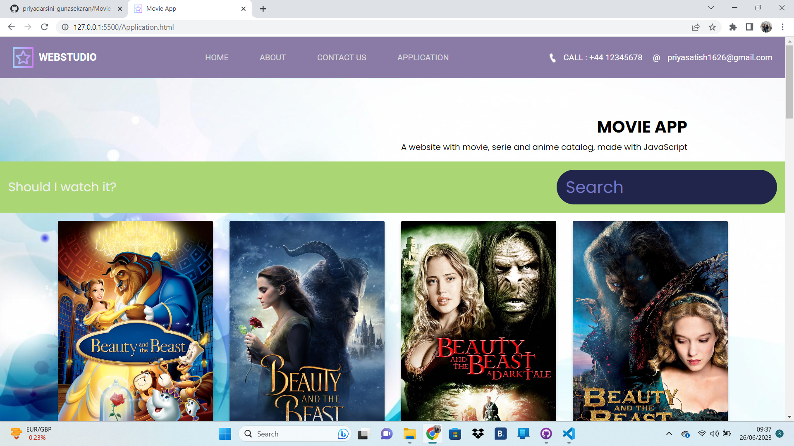

 

  

  <h3 align="center">Simple  Movie App</h3>

  

    Movie App with JS
     
     
    <a href="https://github.com/priyadarsini-gunasekaran/Movie-App-with-JS"><strong>Explore the docs »</strong></a>
     
     
    <a href="https://github.com/priyadarsini-gunasekaran/Movie-App-with-JS">View Demo</a>
    .
    <a href="https://github.com/priyadarsini-gunasekaran/Movie-App-with-JS/issues">Report Bug</a>
    .
    <a href="https://github.com/priyadarsini-gunasekaran/Movie-App-with-JS/issues">Request Feature</a>
  

      

## Table Of Contents

* [About the Project](#about-the-project)
* [Built With](#built-with)
* [Roadmap](#roadmap)
* [Contributing](#contributing)
* [License](#license)
* [Authors](#authors)

## About The Project

A website with movie, serie and anime catalog, made with JavaScript.his is a movie app where you can search for any Movie/TV Show and retrieve information about the same.

## Built With

1) HTML
2) CSS
3) Javascript
4) Bootstrap

## Roadmap

See the [open issues](https://github.com/priyadarsini-gunasekaran/Movie-App-with-JS/issues) for a list of proposed features (and known issues).

## Contributing

Contributions are what make the open source community such an amazing place to be learn, inspire, and create. Any contributions you make are **greatly appreciated**.
* If you have suggestions for adding or removing projects, feel free to [open an issue](https://github.com/priyadarsini-gunasekaran/Movie-App-with-JS/issues/new) to discuss it, or directly create a pull request after you edit the *README.md* file with necessary changes.
* Please make sure you check your spelling and grammar.
* Create individual PR for each suggestion.
* Please also read through the [Code Of Conduct](https://github.com/priyadarsini-gunasekaran/Movie-App-with-JS/blob/main/CODE_OF_CONDUCT.md) before posting your first idea as well.

### Creating A Pull Request

1. Fork the Project
2. Create your Feature Branch (`git checkout -b feature/AmazingFeature`)
3. Commit your Changes (`git commit -m 'Add some AmazingFeature'`)
4. Push to the Branch (`git push origin feature/AmazingFeature`)
5. Open a Pull Request

## License

Distributed under the MIT License. See [LICENSE](https://github.com/priyadarsini-gunasekaran/Movie-App-with-JS/blob/main/LICENSE.md) for more information.

## Authors

* **Priya Satish** - *Learning to code* - [Priya Satish](https://github.com/priyadarsini-gunasekaran/) - *Built website*

